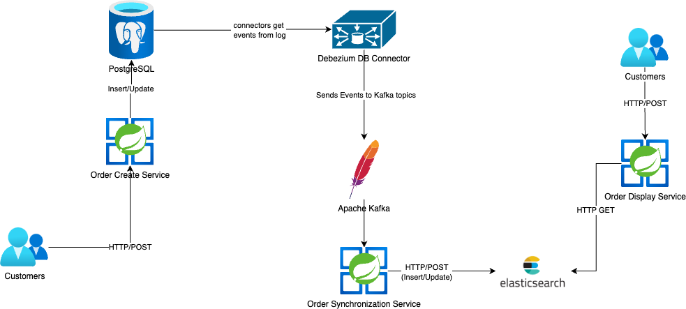

# Order Service

Order Service, CQRS (Command Query Responsibility Segregation) tasarım deseni kullanılarak geliştirilmiş bir mikro servis uygulamasıdır. Uygulama, sipariş yönetimi ve senkronizasyonu için çeşitli servislerden oluşmaktadır.

## İçerdiği Servisler

- **Order Service**: Siparişlerin oluşturulması, güncellenmesi ve yönetilmesini sağlar.
- **Order Synchronization Service**: Debezium kullanarak veritabanındaki değişiklikleri dinler ve Kafka üzerinden iletir.
- **Order Display Service**: Kafka'dan gelen olayları işleyerek siparişlerin okunmasını optimize eder.

## Kullanılan Teknolojiler

- **Spring Boot**: Uygulamanın temel çatısı.
- **PostgreSQL**: Veritabanı yönetim sistemi.
- **Debezium**: PostgreSQL üzerindeki değişiklikleri dinleyerek Kafka’ya iletmek için kullanılır.
- **Kafka**: Mesajlaşma sistemi olarak kullanılır ve event-driven yapıyı destekler.
- **Elasticsearch**: Veritabanı yönetim sistemi

## CQRS Mimarisi

Uygulama, CQRS mimarisini kullanarak **okuma (read) ve yazma (write) işlemlerini ayırır**:
- **Write Model**: Order Service, siparişleri oluşturur ve günceller. PostgreSQL'e kaydedilir.
- **Read Model**: Order Synchronization Service, Debezium ile değişiklikleri Kafka'ya iletir. Order Display Service, Kafka'dan olayları alıp optimize edilmiş elasticsearch db ye yazar. Elasticsearch'e yazılan veriler cqrs kapsamında, order-display servisten okunur



### Gerekli Containerları çalıştırma

```
docker-compose up -d 
```

#### Generating debezium connectors

Containerları ayağa kaldırdıktan sonra, aşağıdaki http istekleriyle localinizde gerekli debezium connectorları oluşturabilirsiniz.

```
curl --location 'http://localhost:8083/connectors' \
--header 'Content-Type: application/json' \
--data '{
    "name": "postgres-connector-customers",
    "config": {
      "connector.class": "io.debezium.connector.postgresql.PostgresConnector",
      "database.hostname": "postgresql",
      "database.port": "5432",
      "database.user": "user",
      "database.password": "pass",
      "database.dbname": "orders",
      "topic.prefix": "debezium-customers",
      "table.include.list": "public.customers",
      "plugin.name": "pgoutput",
      "slot.name": "debezium_slot",
      "publication.name": "dbz_publication",
      "key.converter": "org.apache.kafka.connect.json.JsonConverter",
      "value.converter": "org.apache.kafka.connect.json.JsonConverter",
      "key.converter.schemas.enable": "false",
      "value.converter.schemas.enable": "false",
      "transforms": "unwrap,route",
      "transforms.unwrap.type": "io.debezium.transforms.ExtractNewRecordState",
      "transforms.route.type": "org.apache.kafka.connect.transforms.RegexRouter",
      "transforms.route.regex": "postgres_server.public.orders",
      "transforms.route.replacement": "customers-create-topic"
    }
  }'
 
```
```
  curl --location 'http://localhost:8083/connectors' \
--header 'Content-Type: application/json' \
--data '{
    "name": "postgres-connector-orders",
    "config": {
      "connector.class": "io.debezium.connector.postgresql.PostgresConnector",
      "database.hostname": "postgresql",
      "database.port": "5432",
      "database.user": "user",
      "database.password": "pass",
      "database.dbname": "orders",
      "topic.prefix": "debezium-orders",
      "table.include.list": "public.orders",
      "plugin.name": "pgoutput",
      "slot.name": "debezium_slot_orders",
      "publication.name": "dbz_publication",
      "key.converter": "org.apache.kafka.connect.json.JsonConverter",
      "value.converter": "org.apache.kafka.connect.json.JsonConverter",
      "key.converter.schemas.enable": "false",
      "value.converter.schemas.enable": "false",
      "transforms": "unwrap,route",
      "transforms.unwrap.type": "io.debezium.transforms.ExtractNewRecordState",
      "transforms.route.type": "org.apache.kafka.connect.transforms.RegexRouter",
      "transforms.route.regex": "postgres_server.public.orders",
      "transforms.route.replacement": "orders-create-topic"
    }
  }'

```
```

  {
    "name": "postgres-connector-order-lines",
    "config": {
      "connector.class": "io.debezium.connector.postgresql.PostgresConnector",
      "database.hostname": "postgresql",
      "database.port": "5432",
      "database.user": "user",
      "database.password": "pass",
      "database.dbname": "orders",
      "topic.prefix": "debezium-order-lines",
      "table.include.list": "public.order_lines",
      "plugin.name": "pgoutput",
      "slot.name": "debezium_slot_order_lines",
      "publication.name": "dbz_publication",
      "key.converter": "org.apache.kafka.connect.json.JsonConverter",
      "value.converter": "org.apache.kafka.connect.json.JsonConverter",
      "key.converter.schemas.enable": "false",
      "value.converter.schemas.enable": "false",
      "transforms": "unwrap,route",
      "transforms.unwrap.type": "io.debezium.transforms.ExtractNewRecordState",
      "transforms.route.type": "org.apache.kafka.connect.transforms.RegexRouter",
      "transforms.route.regex": "postgres_server.public.order-lines",
      "transforms.route.replacement": "order-lines-create-topic"
    }
  }
```

